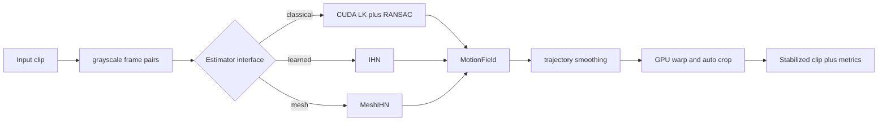

# gimbal-engine

<p align="center"><em>GPU video stabilization with two interchangeable camera motion estimators, a custom CUDA pipeline and a learned homography network, benchmarked head to head.</em></p>

<p align="center"></p>

> **Install**
>
> ```bash
> pip install gimbal_engine
> ```
>
> Building the compiled CUDA extension needs an NVIDIA GPU and a CUDA toolkit. The trained weights ship inside the package, so a successful install can stabilize immediately with no extra download. If you do not have a local toolchain, the Docker path under [Build and install](#build-and-install) builds everything.

Gimbal Engine stabilizes shaky video on the GPU. Its real subject is a head to head comparison of two interchangeable camera motion estimators: a classical pipeline written in CUDA (pyramidal Lucas-Kanade tracking with RANSAC homography fitting) and an iterative homography network (IHN) trained from scratch. Both sit behind one shared `Estimator` interface and feed the same back end (trajectory smoothing, GPU warping, auto crop, and the standard stabilization metrics), so they can be swapped and measured on identical footage. The two share more than that interface: each turns its four corner estimates into a homography through the same differentiable Tensor-DLT, solved on the GPU.

## Stabilization, side by side

Three NUS clips, across rotation, running, and crowd scenes. Each row is one clip: the shaky input, the gimbal IHN result, and the classical CUDA result, with the stability score under each.

<div align="center">
<table>
<tr>
<td align="center"></td>
<td align="center"></td>
<td align="center"></td>
</tr>
<tr>
<td align="center"><b>Shaky input</b></td>
<td align="center"><b>gimbal IHN</b><br>stability 0.928</td>
<td align="center"><b>Classical</b><br>stability 0.264</td>
</tr>
<tr><td colspan="3" align="center"><sub>QuickRotation/19.avi</sub></td></tr>
<tr>
<td align="center"></td>
<td align="center"></td>
<td align="center"></td>
</tr>
<tr>
<td align="center"><b>Shaky input</b></td>
<td align="center"><b>gimbal IHN</b><br>stability 0.973</td>
<td align="center"><b>Classical</b><br>stability 0.631</td>
</tr>
<tr><td colspan="3" align="center"><sub>Running/1.avi</sub></td></tr>
<tr>
<td align="center"></td>
<td align="center"></td>
<td align="center"></td>
</tr>
<tr>
<td align="center"><b>Shaky input</b></td>
<td align="center"><b>gimbal IHN</b><br>stability 0.908</td>
<td align="center"><b>Classical</b><br>stability 0.495</td>
</tr>
<tr><td colspan="3" align="center"><sub>Crowd/14.avi</sub></td></tr>
</table>
</div>

These are clips where the IHN is strongest. On large zoom and parallax the classical pipeline is steadier, and the full per category numbers, wins and losses, are in [Results](#results).

[Highlights](#highlights) · [What is inside](#what-is-inside) · [Architecture](#architecture) · [Results](#results) · [Correctness](#correctness) · [Build and install](#build-and-install)

## Highlights

- A fused local correlation CUDA operator with its own forward and backward pass. Against the PyTorch reference it is 26.3x faster and uses 1.72x less memory (forward and backward, RTX 5070 Ti laptop).
- The trained IHN reaches a sub pixel mean average corner error of 0.863 px on held out synthetic pairs, against 6.489 px for a single shot regression baseline. The iterative refinement is the difference.
- A mesh (multi homography) model that fits a grid of local homographies and reduces exactly to the single global homography at a 1x1 grid. On synthetic parallax it lowers corner error against the global model by 6.5 px (see [the mesh study](mesh_study/README.md)).
- One `Estimator` interface for all three. The classical pipeline, the global IHN, and the mesh model return the same `MotionField`, so the pipeline never knows which one it is running.
- Field standard evaluation: the NUS dataset, reported as the cropping ratio, distortion value, and stability score triplet, plus CUDA event timing.
- The whole inference loop captured into a CUDA graph, which removes the launch overhead that dominates at this size and gives an 11.4x end to end speedup.

## What is inside

Two estimators, one back end. The core of the project is the comparison between them and the geometry they share.

| Component | What it is |
|---|---|
| Classical estimator | Shi-Tomasi corners, pyramidal Lucas-Kanade tracking, RANSAC homography fitting, all in CUDA |
| Learned estimator (IHN) | Feature encoder, local correlation cost volume, iterative 4 point refinement, differentiable Tensor-DLT |
| Regression baseline | Single shot 4 point regression (the ablation control for the IHN) |
| Mesh estimator | A grid of per cell homographies (MeshFlow style), reducing to the global model at a 1x1 grid |
| Fused correlation op | A compiled CUDA autograd operator for the cost volume, gated behind a gradient check |
| Shared back end | Trajectory smoothing, GPU warp, auto crop, and the stabilization metric triplet |
| Smoothers | Gaussian, Kalman RTS, and L1-TV camera path smoothing |

The classical and learned estimators are interchangeable because they agree on one contract: take two consecutive grayscale frames, return a `MotionField` that maps frame A coordinates to frame B coordinates. Everything downstream, the smoothing, the warp, the metrics, sees only that result and never the model that produced it.

## Architecture



The classical estimator runs the parallel path entirely in CUDA: Shi-Tomasi corner detection, pyramidal Lucas-Kanade tracking of those corners across the frame pair, and a RANSAC homography fit over the surviving matches, with a degenerate fit falling back to identity rather than a bad warp.

The IHN follows the iterative homography idea. A shared encoder turns both frames into feature maps. At each of six iterations the model builds a local correlation cost volume between the current warped features and the target, predicts an update to four corner offsets, and turns those offsets into a homography with the Tensor-DLT. The cost volume is the hot path, which is why it has a dedicated fused CUDA operator. The mesh model replaces the single set of four corners with a grid of cells, each with its own local homography, blended into a smooth sampling field; with a 1x1 grid it is identical to the global IHN.

Both paths produce a homography per frame pair. The shared back end turns that sequence into a stabilized clip: it accumulates the per frame motion into a camera path, smooths the path (Gaussian, Kalman RTS, or L1-TV), warps each frame by the difference between the original and smoothed path on the GPU, and auto crops to the largest rectangle that stays inside every warped frame.

## Results

All numbers below are measured on an RTX 5070 Ti laptop GPU (Blackwell, sm_120), torch 2.11.0+cu128.

### Stabilization on NUS

Classical against the learned IHN across all six NUS scene categories (144 clips, the shipped IHN trained only on synthetic data so the entire NUS set is held out). Higher stability is better; the throughput column is the per frame rate.

<div align="center">

<table>
<tr><th>Category</th><th>Classical stability</th><th>IHN stability</th><th>Classical fps</th><th>IHN fps</th></tr>
<tr><td>Regular</td><td><b>0.886</b></td><td>0.864</td><td>16.5</td><td><b>27.8</b></td></tr>
<tr><td>QuickRotation</td><td>0.862</td><td><b>0.897</b></td><td>16.3</td><td><b>27.2</b></td></tr>
<tr><td>Zooming</td><td><b>0.879</b></td><td>0.766</td><td>16.9</td><td><b>25.2</b></td></tr>
<tr><td>Parallax</td><td><b>0.877</b></td><td>0.812</td><td>16.3</td><td><b>25.6</b></td></tr>
<tr><td>Crowd</td><td><b>0.848</b></td><td>0.833</td><td>16.7</td><td><b>24.9</b></td></tr>
<tr><td>Running</td><td>0.848</td><td><b>0.852</b></td><td>16.3</td><td><b>26.7</b></td></tr>
<tr><td>Mean</td><td><b>0.867</b></td><td>0.837</td><td>16.5</td><td><b>26.3</b></td></tr>
</table>

</div>

The IHN wins the hard rotation case and runs about 1.6x faster everywhere. The classical pipeline is steadier on large zoom and parallax, which are the motions furthest from the IHN's synthetic training distribution.

<p align="center"></p>

<p align="center"></p>

### Training ablation

Mean average corner error (MACE) on held out synthetic COCO pairs, lower is better. The iterative model and the single shot regression baseline use the same data and encoder.

<div align="center">
<table>
<tr><th>Model</th><th>Best MACE</th></tr>
<tr><td><b>IHN (iterative, 6 steps)</b></td><td><b>0.863 px</b></td></tr>
<tr><td>Regression baseline (single shot)</td><td>6.489 px</td></tr>
</table>
</div>

Iterative refinement is roughly 7.5x more accurate than predicting the homography in one shot, and it lands at sub pixel error.

### Systems study

The cost volume operator and the inference loop, measured on the same GPU. The full study, including the roofline and the optimization log, is in [perf_study](perf_study/README.md).

<div align="center">

<table>
<tr><th>Measurement</th><th>Result</th></tr>
<tr><td>Fused correlation against the PyTorch reference</td><td><b>26.3x faster, 1.72x less memory</b></td></tr>
<tr><td>CUDA graph replay against eager inference</td><td><b>11.4x faster</b> (41.2 ms to 3.61 ms per call)</td></tr>
<tr><td>fp16 accuracy cost (MACE)</td><td>+0.002 px</td></tr>
<tr><td>bf16 accuracy cost (MACE)</td><td>+0.029 px</td></tr>
</table>

</div>

<p align="center"></p>

The roofline shows why the simplest kernel wins: at a 16x16 cost volume the operation is latency and occupancy bound, not compute bound, so launching enough threads with coalesced loads beats reducing arithmetic.

## Correctness

Each GPU component is checked against an independent reference. The full suite is 41 tests.

| Check | Reference | Result |
|---|---|---|
| Scharr gradient kernel | OpenCV `cv2.Scharr` | match to 1e-3 |
| Gaussian downsample kernel | OpenCV `cv2.pyrDown` | match to 1e-2 |
| Shi-Tomasi corner response | NumPy and OpenCV reference | match |
| Classical estimator | known homography (`cv2.warpPerspective`) | recovers translation and rotation |
| Tensor-DLT | known homography | match to 1e-3 |
| Tensor-DLT gradient | `torch.autograd.gradcheck` | passes |
| Fused correlation forward | PyTorch reference | match to 1e-4 |
| Fused correlation backward | PyTorch autograd | match to 1e-4 |
| Fused correlation gradient | gradcheck in float64 | passes |
| No pivot DLT solve | cuSOLVER (`torch.linalg.solve`) | match to 1e-4 |
| CUDA graph replay | eager execution | max error 4e-5 |
| Mesh 1x1 grid | single global homography | match to 1e-5 |
| Global MotionField path | raw homography product | bit exact |
| Phase B adoption guard | a deliberately degrading run | reverts to the kept weights |

The fused correlation operator is gated: it is only used after it passes the gradient check against the PyTorch reference, otherwise the model falls back to the reference implementation.

## Build and install

The package is published as a source distribution. pip compiles the CUDA extension on your machine at install time, so it adapts to your CUDA version and GPU architecture, and the trained weights are bundled inside the package.

### With a CUDA toolchain

> ```bash
> pip install gimbal_engine
> ```

This needs an NVIDIA GPU and a CUDA toolkit (nvcc) that matches your PyTorch build. The build detects your GPU architecture; if nvcc is missing it stops with a clear message rather than a compiler error.

### With Docker

If you do not have a local toolchain, the included image carries CUDA, PyTorch, and the build tools.

```bash
./run.ps1 image          # build the image
./run.ps1 cli stabilize input.mp4 output.mp4 --estimator ihn
```

### Use it

```bash
gimbal stabilize input.mp4 output.mp4 --estimator ihn      # learned model, bundled weights
gimbal stabilize input.mp4 output.mp4 --estimator classical
gimbal benchmark                                            # classical against IHN on NUS
gimbal info                                                 # GPU and library versions
```

gimbal requires CUDA cores, so will likely require an external GPU. It will proceed to error without this. 

## License

MIT. See [LICENSE](LICENSE).
