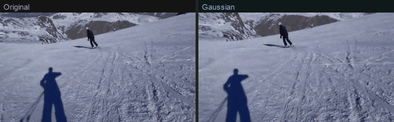
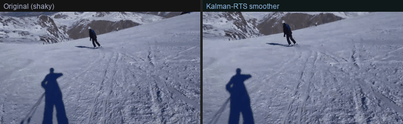
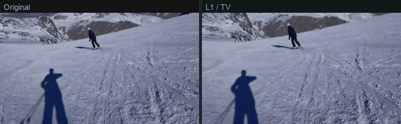

# cuda-motion-flow

**GPU-accelerated video stabilization with COLMAP trajectory export.**

Every stage runs on the GPU — Shi-Tomasi corner detection, pyramidal Lucas-Kanade
tracking, vectorised RANSAC, trajectory smoothing, and bilinear affine warping.
The recovered camera motion exports directly to COLMAP for use in Gaussian Splatting,
NeRF, and Structure-from-Motion pipelines.

[](https://pypi.org/project/cuda-motion-flow/)
[](https://pypi.org/project/cuda-motion-flow/)
[](LICENSE)
[](https://developer.nvidia.com/cuda-downloads)

---

| Gaussian convolution | Kalman-RTS smoother | L1 / Total-Variation |
|:---:|:---:|:---:|
|  |  |  |
| Fast, symmetric | Best quality — optimal | Preserves intentional pans |

*Each clip: original shaky footage (left) vs stabilized output (right)*

---

## What it does

- **Full GPU pipeline** — raw CUDA C++ kernels for the hot path; no CPU fallback in production
- **Three trajectory smoothers** — Gaussian, Kalman-RTS (globally optimal), L1/TV (preserves pans)
- **COLMAP export** — per-frame R, t, quaternion for direct input to Gaussian Splatting / SfM
- **Quality analysis** — companion script with 5 metric categories (stability, smoothness, frequency, SSIM, PSNR)
- **Rich CLI** — progress bars, per-stage timing, VRAM display

---

## Pipeline

```
Input frames
    │
    ▼  Stage 1 — Corner detection
    │  Scharr gradient + Shi-Tomasi response
    │  Shared-memory tiled raw CUDA kernel; 22×22 compile-time tile; __ldg() L1 reads
    │
    ▼  Stage 2 — Feature tracking
    │  Pyramidal Lucas-Kanade — all N points processed in parallel
    │  Pyramid built with raw CUDA anti-aliased 2× Gaussian downsampling kernel
    │
    ▼  Stage 3 — Transform estimation
    │  GPU RANSAC — all 500 hypotheses scored simultaneously (n_iter × n_pts grid)
    │  Affine refinement over inliers: cupy.linalg.lstsq
    │
    ▼  Stage 4 — Trajectory smoothing
    │  gaussian   Gaussian convolution — fast, symmetric
    │  kalman     Rauch-Tung-Striebel optimal smoother — globally minimum-variance
    │  l1         Total-Variation / Chambolle-Pock ADMM — preserves intentional pans
    │
    ▼  Stage 5 — Frame warping
    │  Bilinear affine warp: 32×8 thread block, #pragma unroll channels, __ldg()
    │  Two non-blocking CUDA streams — overlaps H→D transfers with GPU compute
    │
    ▼  Stage 6 — Camera pose export  (optional)
       Homography → R, t via Malis-Vargas decomposition
       Quaternion via Shepperd's method
       COLMAP cameras.txt / images.txt  or  JSON
```

---

## Installation

**1. Check your CUDA version**

```bash
nvcc --version
```

**2. Install the matching CuPy build**

```bash
pip install cupy-cuda13x   # CUDA 13.x
pip install cupy-cuda12x   # CUDA 12.x
```

**3. Install the package**

```bash
pip install cuda-motion-flow
```

**Recommended — virtual environment**

```bash
python -m venv .venv
.venv\Scripts\activate        # Windows
source .venv/bin/activate     # Linux / macOS
pip install cupy-cuda13x cuda-motion-flow
```

---

## Quick start

### CLI

```bash
# Default — Gaussian smoother
cuda-motion-flow shaky.mp4 stable.mp4

# Kalman-RTS — best quality on mixed motion
cuda-motion-flow input.mp4 output.mp4 --smoother kalman --smoothing 0.6

# L1 / Total-Variation — preserves intentional pans
cuda-motion-flow vlog.mp4 vlog_stable.mp4 --smoother l1 --smoothing 0.4

# Export COLMAP trajectory for Gaussian Splatting / SfM
cuda-motion-flow input.mp4 output.mp4 --export-trajectory ./colmap/

# GPU device info
cuda-motion-flow --device-info
```

### Python API

```python
from cuda_motion_flow import stabilize_video

# Basic
stabilize_video("shaky.mp4", "stable.mp4", smoothing_factor=0.4)

# Kalman-RTS with COLMAP export
stabilize_video(
    "shaky.mp4", "stable.mp4",
    smoother="kalman",
    smoothing_factor=0.6,
    export_trajectory="./colmap/",   # writes cameras.txt + images.txt
)

# JSON trajectory
stabilize_video(
    "shaky.mp4", "stable.mp4",
    export_trajectory="trajectory.json",
)
```

---

## Trajectory smoothers

| Smoother   | Algorithm                             | When to use                                |
|------------|---------------------------------------|--------------------------------------------|
| `gaussian` | Gaussian convolution                  | Fast previews, short clips                 |
| `kalman`   | Rauch-Tung-Striebel optimal smoother  | General use — best quality on mixed motion |
| `l1`       | Total-Variation (Chambolle-Pock ADMM) | Content with intentional pans to preserve  |

**Kalman-RTS** is the globally optimal (minimum-variance) batch smoother for a
constant-velocity linear Gaussian trajectory model. It adapts automatically —
the effective smoothing window adjusts to local motion magnitude.
`smoothing_strength` controls the process-to-measurement noise ratio Q/R.

**L1 / TV** produces piecewise-constant trajectories. High-frequency jitter is
removed; deliberate camera moves are left intact. Solved via Chambolle-Pock
primal-dual ADMM.

---

## COLMAP trajectory export

```bash
cuda-motion-flow input.mp4 stable.mp4 --export-trajectory ./colmap/
```

Output structure:

```
colmap/
  cameras.txt    # PINHOLE model — f = max(W, H), cx = W/2, cy = H/2
  images.txt     # Per-frame qvec (Hamilton) + tvec in COLMAP convention
  points3D.txt   # Empty placeholder
```

JSON format (`.json` suffix):

```json
{
  "intrinsics": { "fx": 1280.0, "fy": 1280.0, "cx": 640.0, "cy": 360.0 },
  "frames": [
    {
      "id": 0,
      "R": [[1,0,0],[0,1,0],[0,0,1]],
      "t": [0.0, 0.0, 0.0],
      "qvec": [1.0, 0.0, 0.0, 0.0],
      "camera_center": [0.0, 0.0, 0.0]
    }
  ]
}
```

Direct geometry API:

```python
from cuda_motion_flow.geometry import estimate_intrinsics, decompose_homography, build_trajectory

K    = estimate_intrinsics(width=1280, height=720)
traj = build_trajectory(homographies, K)

traj.export_colmap("./colmap/")
traj.export_json("trajectory.json")
```

---

## Quality analysis

Compare original vs stabilized outputs across five metric categories:

```bash
python compare_videos.py test.mp4 out_gaussian.mp4 out_kalman.mp4 out_l1.mp4
```

GPU-accelerated (uses the same LK pipeline as the stabilizer). Falls back to
CPU Farneback automatically if CUDA is unavailable. Force CPU with `--cpu`.

| Category  | Metrics |
|-----------|---------|
| Stability | Mean / std / P95 / max motion, stability score `1/(1+σ)` |
| Smoothness | Velocity std `|Δm|`, jerk std `|Δ²m|` |
| Frequency | High/low-freq power ratio, spectral centroid (fps/4 threshold) |
| Visual | Temporal SSIM, Laplacian sharpness |
| Fidelity | SSIM vs original, PSNR vs original |

---

## Raw CUDA kernels

All performance-critical operations are raw CUDA C++ kernels compiled at
runtime via `cupy.RawKernel`. No Python dispatch overhead in the hot path.

| Kernel | Configuration |
|--------|---------------|
| `affine_warp_bilinear_u8` | 32×8 block · `__ldg()` L1 reads · `#pragma unroll` 3× |
| `gaussian_downsample_f32` | 16×16 tile · 36×36 shared-memory halo · separable 5-tap |
| `scharr_gradient_f32` | 18×18 shared-memory tile · Gx and Gy in one pass |
| `shi_tomasi_response_f32` | 22×22 compile-time tile · min-eigenvalue response |

All kernels accept an optional `stream` argument. Frame warping uses two
non-blocking CUDA streams to pipeline H→D transfers with compute.

---

## CLI reference

```
Usage: cuda-motion-flow [OPTIONS] INPUT_VIDEO OUTPUT_VIDEO

Smoothing:
  --smoother [gaussian|kalman|l1]   Algorithm            [default: gaussian]
  --smoothing FLOAT RANGE           Strength 0.0–1.0     [default: 0.3]

Output:
  --no-crop                         Disable auto-crop of black borders
  --no-resize                       Keep cropped resolution
  --export-trajectory PATH          .json or COLMAP directory

Diagnostics:
  -v, --verbose                     Per-stage timing
  --device-info                     Print GPU info and exit
  --help                            Show this message and exit
```

---

## Python API reference

```python
# Stabilization
stabilize_video(input_path, output_path,
    smoothing_factor=0.3, smoother="gaussian",
    verbose=False, auto_crop=True, preserve_resolution=True,
    export_trajectory=None)

# Device
check_cuda_available() -> bool
get_device_info()      -> dict        # device_name, compute_capability, memory

# Pipeline primitives
compute_optical_flow_gpu(prev_gray, curr_gray)           -> (prev_pts, curr_pts)
estimate_transform_from_flow_gpu(prev_pts, curr_pts)     -> (H, dx, dy, da)
detect_corners_gpu(img, max_corners, quality, min_dist)  -> corners
track_points_gpu(prev, curr, pts, window_size, max_level) -> (tracked, status)
ransac_affine_gpu(src, dst, n_iter, threshold)           -> (M_2x3, inliers)

# Trajectory
smooth_trajectory(dx, dy, da, method, smoothing_strength) -> (N, 3, 3)

# Geometry
estimate_intrinsics(width, height)   -> CameraIntrinsics
decompose_homography(H, K)           -> List[(R, t, n)]
build_trajectory(homographies, K)    -> CameraTrajectory
```

---

## Requirements

- Python 3.9+
- NVIDIA GPU — CUDA 12.x or 13.x
- `cupy-cuda12x` or `cupy-cuda13x` — install separately, match `nvcc --version`
- `opencv-python >= 4.8`
- `numpy >= 1.22`
- `rich >= 13.0`
- `rich-click >= 1.7`

---

## License

MIT
