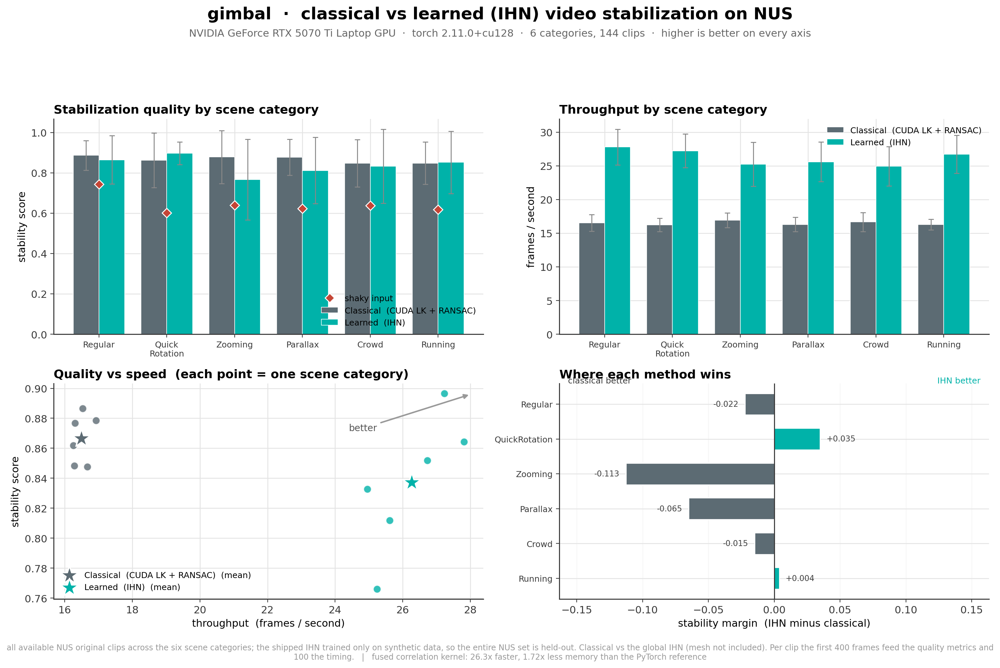
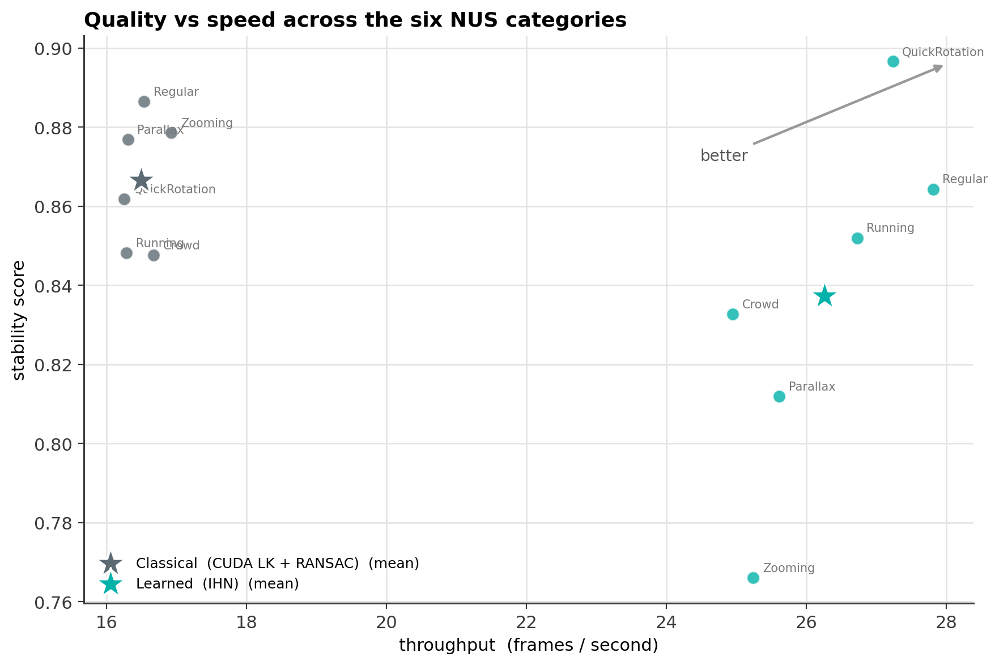

# NUS stabilization benchmark

Classical (CUDA Lucas-Kanade + RANSAC homography) vs the learned IHN estimator, run head to head on the NUS benchmark clips. Higher is better on every metric.

- GPU: NVIDIA GeForce RTX 5070 Ti Laptop GPU, torch 2.11.0+cu128
- Scope: all available NUS original clips across the six scene categories; the shipped IHN trained only on synthetic data, so the entire NUS set is held-out. Classical vs the global IHN (mesh not included). Per clip the first 400 frames feed the quality metrics and 100 the timing.
- Fused correlation kernel: 26.3x faster and 1.72x lighter than the PyTorch reference

## Per-category means

| category | estimator | stability | cropping | distortion | fps |
|---|---|---|---|---|---|
| Regular | classical | 0.886 | 0.916 | 0.942 | 16.5 |
| Regular | ihn | 0.864 | 0.919 | 0.853 | 27.8 |
| QuickRotation | classical | 0.862 | 0.915 | 0.390 | 16.3 |
| QuickRotation | ihn | 0.897 | 0.844 | 0.875 | 27.2 |
| Zooming | classical | 0.879 | 0.827 | 0.942 | 16.9 |
| Zooming | ihn | 0.766 | 0.888 | 0.557 | 25.2 |
| Parallax | classical | 0.877 | 0.916 | 0.799 | 16.3 |
| Parallax | ihn | 0.812 | 0.931 | 0.614 | 25.6 |
| Crowd | classical | 0.848 | 0.906 | 0.795 | 16.7 |
| Crowd | ihn | 0.833 | 0.913 | 0.672 | 24.9 |
| Running | classical | 0.848 | 0.781 | 0.738 | 16.3 |
| Running | ihn | 0.852 | 0.813 | 0.825 | 26.7 |

## Overall (mean over categories)

| estimator | stability | fps |
|---|---|---|
| classical | 0.867 | 16.5 |
| ihn | 0.837 | 26.3 |
