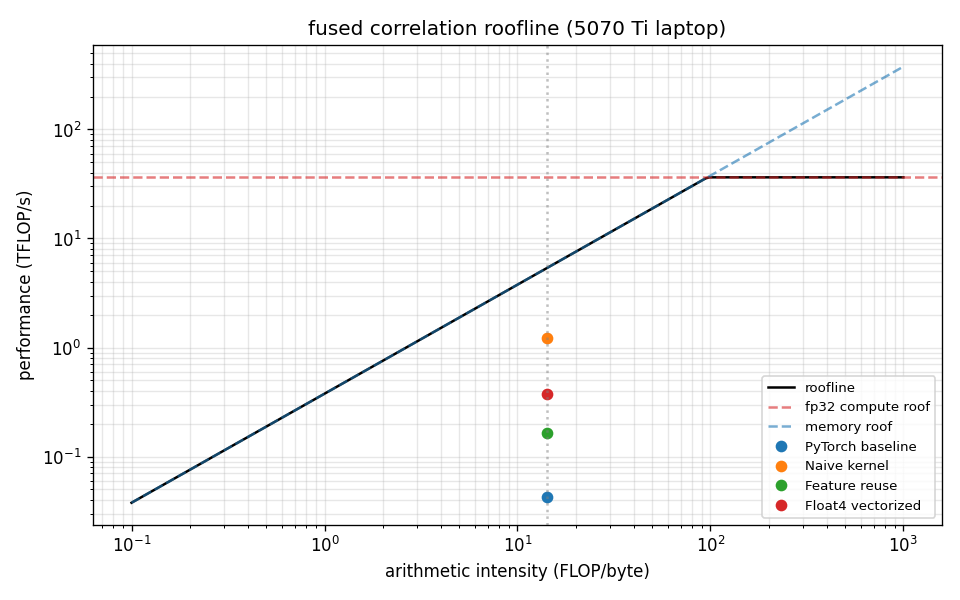

# Systems study: the fused correlation kernel

All numbers measured on an RTX 5070 Ti Laptop GPU (sm_120, 46 SMs), torch 2.11.0+cu128, inside
the project's Docker image, at full clocks (the GPU boosts to P0, 1612 MHz SM / 14201 MHz
memory, under load). Raw data: `optimization_log.{json,csv}`, `roofline.png`, `cuda_graph.json`,
`precision.json`.

## Profiling environment

- **Nsight Compute counters are unavailable here.** `ncu` returns `ERR_NVGPUCTRPERM` even with
  `--privileged`; on WSL2 with a consumer GeForce the GPU performance counters are not exposed
  and the host driver policy can't be changed from the container. So there are no ncu
  warp-stall / DRAM-counter numbers in this study.
- **Nsight Systems is not installed in the image**; the end-to-end timeline uses `torch.profiler`
  (CUPTI), which does work and gives per-kernel device time and launch counts.
- **Clocks are sampled, not pinned.** `nvidia-smi -lgc` cannot lock clocks under WSL2, so each run
  records the clocks it saw under load (P0, 1612 / 14201 MHz here). The memory roof is a measured
  saturating copy at those clocks.
- What is measured: CUDA-event latency, analytic FLOPs / essential bytes, achieved throughput =
  work / measured time, occupancy reasoned from thread counts, and a roofline whose memory roof is
  the measured copy bandwidth (393 GB/s).

## Optimization log (forward, B32 C96 16x16 R4)

| kernel | latency | vs naive | bottleneck |
|---|---|---|---|
| PyTorch baseline | 3.00 ms | 0.03x | overhead: many small ops + temporaries |
| **Naive kernel** | **0.103 ms** | 1.0x | latency-bound: parallel + coalesced, but reaches ~23% of the copy roof |
| Feature reuse (k-tiling) | 0.77 ms | 0.13x | occupancy: 8192 threads vs the naive 663552, too few to hide latency |
| Float4 vectorized (NHWC) | 0.34 ms | 0.30x | uncoalesced: NHWC strides neighbouring threads by C |

The naive kernel is roughly an order of magnitude faster than the PyTorch baseline (14x to 30x
across runs; the baseline fires dozens of small ops so its latency is variable, 29x this run). The
more durable result is the naive-relative column: **the hand "optimizations" are slower than the
naive kernel.** Arithmetic intensity is ~14.2 FLOP/byte, left of the roofline ridge
(~93 FLOP/byte), so the op is memory-side, and even the naive kernel reaches only ~23% of the
393 GB/s copy roof. At 16x16 the volume is tiny, so what matters is launching enough threads (the
naive kernel's 663k) and keeping loads coalesced. Feature reuse cuts redundant `fa` traffic but
collapses to 8k threads and loses latency-hiding; the float4 path's NHWC layout enables wide loads
but breaks warp coalescing. Reducing arithmetic or loads does not help a problem that is occupancy
or latency bound and far from saturating memory.

## End-to-end: the real bottleneck is launch overhead (CUDA graphs)

Full IHN inference profiled with CUPTI: **2179 kernel launches per call, of which only ~18% of
the wall time is GPU-busy** (7.4 ms of kernels inside 41.2 ms). Each of the 6 refinement
iterations fires many small kernels, so launch latency dominates at this scale.

Capturing the whole `predict` into a CUDA graph required a graph-safe DLT solve, because
`torch.linalg.solve` (cuSOLVER) does a host sync that invalidates capture
(`cudaErrorStreamCaptureInvalidated`). Replacing it with a functional no-pivot Gaussian
elimination on the SPD ridge system (matches cuSOLVER to 1e-4) makes the loop capturable.

- eager: **41.2 ms/call**
- graph replay: **3.61 ms/call**, an **11.4x end to end speedup**
- graph vs eager max error: **4e-5** (numerically equivalent, covered by a test)

At this size the speedup comes from removing launch overhead, not from optimizing the kernel.

## Precision (fp16 / bf16 / fp8)

| precision | MACE | delta vs fp32 | correlation latency |
|---|---|---|---|
| fp32 | 0.863 px | - | 1.70 ms |
| fp16 | 0.865 px | +0.002 | 2.44 ms |
| bf16 | 0.892 px | +0.029 | 2.88 ms |

fp16 is essentially free on accuracy (correlation relative error 7e-4) but gives **no throughput
gain** here. If anything the reference correlation is slower in fp16 and bf16, because the op is
latency and memory bound rather than compute bound, so halving the data width buys nothing it can
use. bf16 costs a small amount of MACE. fp8 (`torch.float8_e4m3fn` with `_scaled_mm`) is available
but the 16x16 cost volume is a tiny per pair dot product with no GEMM to amortise, so a tensor core
path would be marginal and was not pursued.
